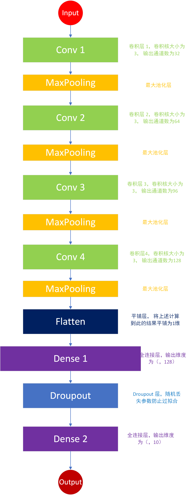
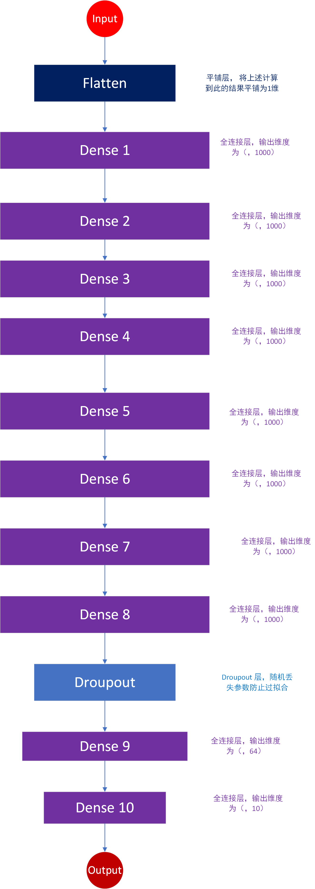
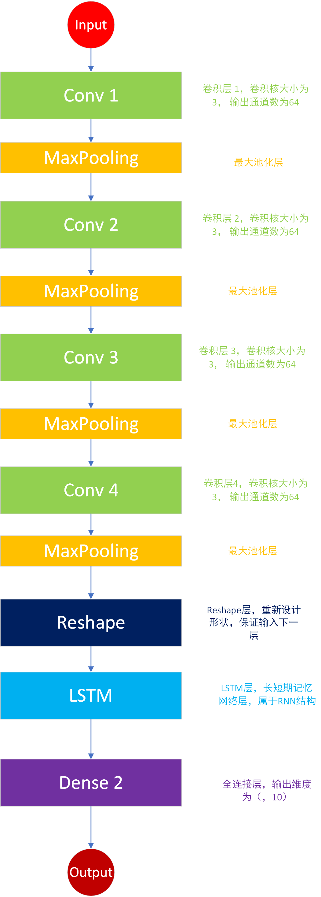

## Dataset
- `urbansound8K`
- `make_data.py` prepare data
## Requirement
- librosa
- tensorflow>2
  
## Models

- CNN
`main_CNN.py` `mainCNN.ipynb`

- DNN
`main_DNN.py` `mainDNN.ipynb`

- CNN & RNN
`main_CRNN.py` `mainCRNN.ipynb`
